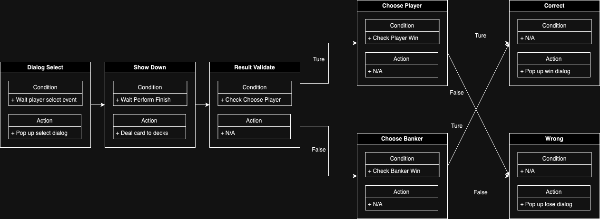
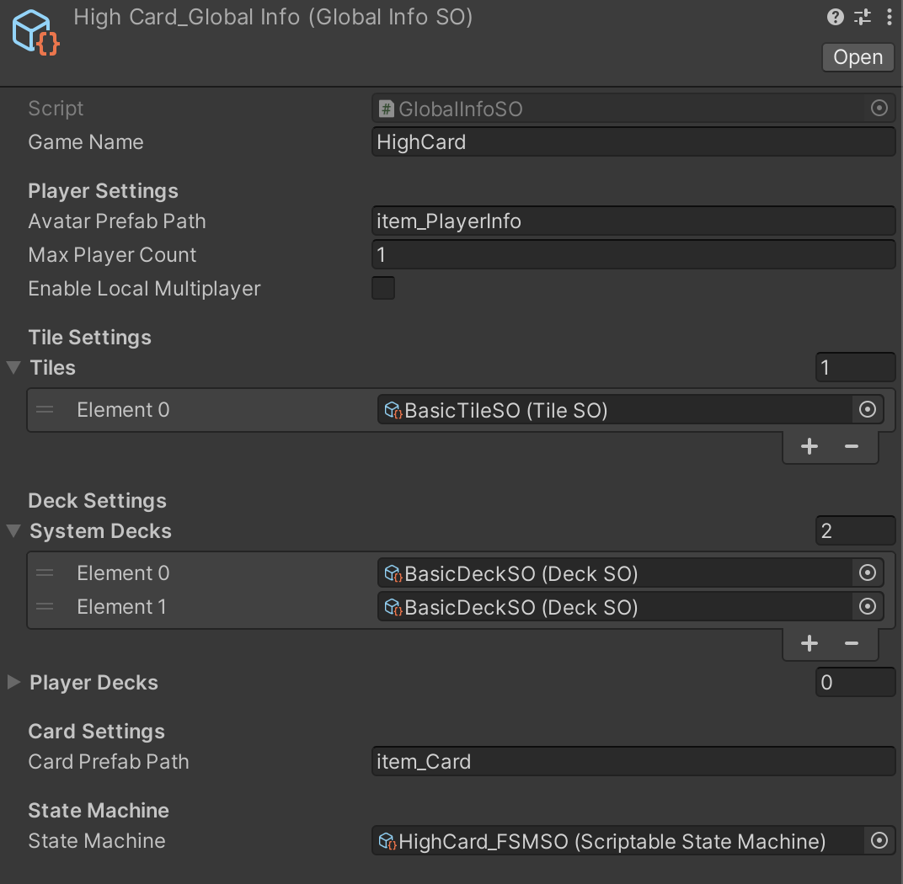
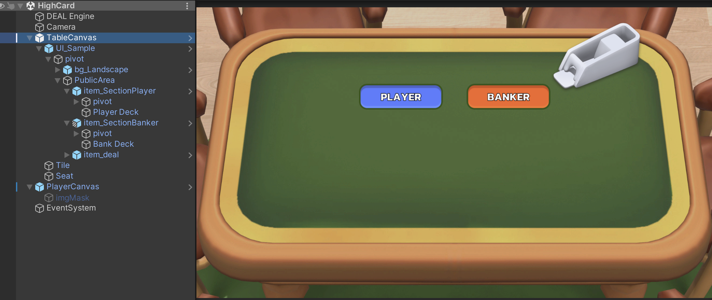

# Quick Start

This guide will walk you through the essential steps to create a **High Card** game in Unity using the **DEAL Toolkit**. By the end, you'll have a fully functional card game and a solid understanding of how to use the DEAL framework effectively.

## Define High Card FSM

In this **High Card** game, the player guesses who will win—either the **Player** or the **Banker**. After the cards are revealed, the game checks if the player's guess was correct.

You can either create a new FSM Scriptable Object (SO) or use the provided `HighCard_FSMSO` located in `Sample/DataSO`.

The FSM consists of 7 states, each with specific functions, explained below:

---

## 1. Dialog Select State

- **Overview**: The player selects who they think will win: **Player** or **Banker**. This state manages the selection process.
  
### Steps:
1. Show a dialog for the player to make their choice. Create an action Scriptable Object (SO) using `ShowDialogAction`. Reference the `SelectWinnerDialog_Action` and add it to the **Entry Actions** of this state.
2. Use the `ChoosePlayer_Condition` SO to check if the player selected "Player" (index 0).

---

## 2. Show Down State

- **Overview**: This state reveals the cards and determines the winner for the current round.

### Steps:
1. Deal 1 card to both the **Player** and **Banker**. Add the following 4 actions to the Entry Actions:
   - `TileDraw1Action`
   - `TileDealToPlayer_PostAction`
   - `TileDraw1Action`
   - `TileDealToBanker_PostAction`
   
2. Add the `CountDown3sAction` to wait for the card flip animation to complete (3 seconds).
3. Unlock the FSM using `EndOfSystemLock_Condition` after 3 seconds.

---

## 3. Result Validate State

- **Overview**: This state validates whether the player's selection matches the actual result of the showdown.

### Steps:
1. Use `ChoosePlayer_Condition` SO to verify if the player’s selection (Player or Banker) was correct.

---

## 4. Choose Player State

- **Overview**: This state checks if the **Player**’s card value is higher than the **Banker**’s, determining if the guess was correct.

### Steps:
1. Use the `PlayerWin_Condition` SO to check if the Player’s card score is higher than the Banker’s.

---

## 5. Choose Banker State

- **Overview**: This state checks if the **Banker**’s card value is higher than the **Player**’s, determining if the Banker wins.

### Steps:
1. Use the `BankerWin_Condition` SO to check if the Banker’s card score is higher than the Player’s.

---

## 6. Correct State

- **Overview**: If the player guessed correctly, this state triggers a dialog displaying the winning result.

### Steps:
1. Add the `ShowCorrectDialogAction` SO to the **Entry Actions** to display the correct result.

---

## 7. Wrong State

- **Overview**: If the player guessed wrong, this state triggers a dialog displaying the losing result.

### Steps:
1. Add the `ShowWrongDialogAction` SO to the **Entry Actions** to display the incorrect result.

---

## Global Info Configuration

The **Global Info** Scriptable Object (SO) holds the global configuration settings for the game, including details like the game name, FSM, player settings, and any necessary global variables.

### Steps:
1. Create a **Global Info** SO by right-clicking in the Project window and selecting `DealToolkit > Global Info`. Name it `HighCard_GlobalInfo`.
2. Set the **Max Player Amount** to 1 (for a single-player game).
3. Set the **Tile/Deck Settings**:
   - Use one `BasicTileSO` for drawing cards.
   - Use two `BasicDeckSO` (one for Player, one for Banker) for placing cards.
4. Set the **Avatar Prefab Path** and **Card Prefab Path**:
   - For avatars, use the `item_PlayerInfo` prefab.
   - For cards, use the `item_Card` prefab.
5. Set the **State Machine** to `HighCard_FSMSO` for the game FSM logic.

---

## Scene Management

### Steps:
1. Create a new scene and add the following prefabs from the sample resources folder:
   - `DealEngine` Prefab
   - `Table Canvas` Prefab
   - `Player Canvas` Prefab
2. Assign the `HighCard_GlobalInfo` SO to the **Global Info SO** reference in the `DealEngine` component.
3. Assign the **Table Canvas** to the `Table` reference in the `DealEngine` component.
4. Assign the **Player Canvas** to the `Dialog Manager` reference in the `ViewManager` component.

---

>Congratulations! You’ve successfully set up the **High Card** game using the DEAL Toolkit. Your game is now ready to play, and you’ve learned how to configure both the FSM and the global game settings.

