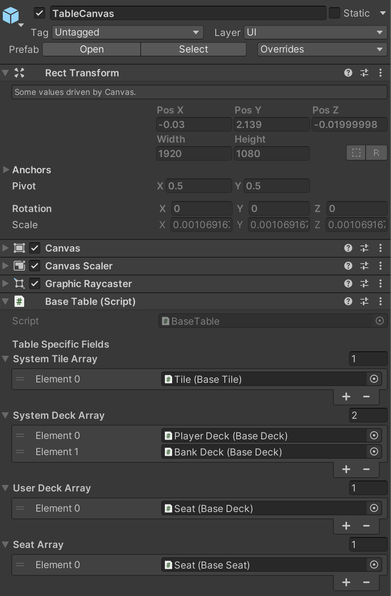

## How to Set Up Game Table

This guide explains how to configure the **game table** in your card game using the DEAL Toolkit. By following these steps, you'll create the main table layout, which includes components like avatars, seats, tiles, and decks.

## Table Canvas
{width=300 height=300}
- **Overview**: The game table consists of essential components like **avatars**, **seats**, **tiles**, and **decks**. These elements are managed by the `BaseTable` component within the **Deal Engine**.
  
### Key Components:
1. **System Tile Array (Base Tile)**: Public card tiles on the table (e.g., community or shared tiles).
2. **System Deck Array (Base Deck)**: Public card decks on the table (e.g., shared community decks).
3. **User Deck Array (Base Deck)**: Personal card decks assigned to individual seats (e.g., player hand decks).
4. **Seat Array (Base Seat)**: A list of player seats used to join the table.

---

## Generate Cards Data

- **Overview**: To create cards, you need to define **Scriptable Objects (SOs)**. These SOs will define the unique attributes and functionalities for each card, such as its appearance and card value.

### Steps:
1. In Unity, right-click in the **Project** window and navigate to `Create > DealToolkit > Card Data`.
2. Define the properties of the cards, including the **Index**, **Suit**, and **Number**.

| **Argument**     | **Description**                                 |
| ---------------- | ----------------------------------------------- |
| **Index**        | The unique index of the card, used to identify it.  |
| **Card Graphic** | The visual display of the card, including both the front and back.     |
| **Card Data**    | The card's poker data, including suit and number. |

> DEAL provides a set of basic poker card data in the `DEAL/Core/CommonSO/BasicCardSO` folder.

---

## Generate Tile and Deck Scriptable Objects

- **Overview**: **Tiles** and **decks** are foundational elements in your card game. Tiles represent the locations on the table where cards can be placed, while decks are collections of cards that players or the system can draw from.

### Steps:

1. **Create Tiles**:
   - In the **Project** window, right-click and navigate to `Create > DealToolkit > Tile Data`.
   - Edit the Tile data and link all 52 poker card data to the Tile's **Card Pool**. Alternatively, you can use the pre-existing `BasicTileSO` from the `DEAL/Core/CommonSO` folder.

2. **Create Decks**:
   - Create the **Player** and **Banker** decks by navigating to `Create > DealToolkit > Deck Data`.
   - In this specific case, no card data is required for the **Deck Card Pool**, so you can use the pre-existing `BasicDeckSO` located in the `DEAL/Core/CommonSO` folder.

---

### Additional Notes:

- **Tile and Deck Settings**: The tiles and decks you configure are linked directly to the game's visual and functional flow. Ensure you have properly assigned the correct data (like card pools) to these objects for a smooth game setup.
- **Component Relationships**: The **BaseTable** component ensures that all elements (seats, decks, and tiles) work together seamlessly. Be sure to assign the appropriate arrays and references in the component inspector.

